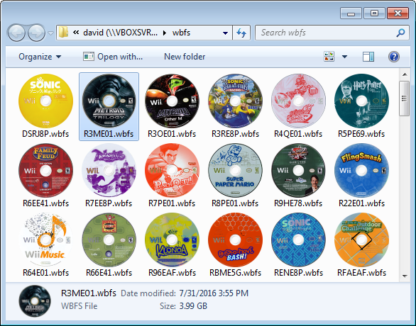
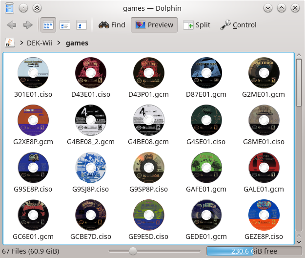
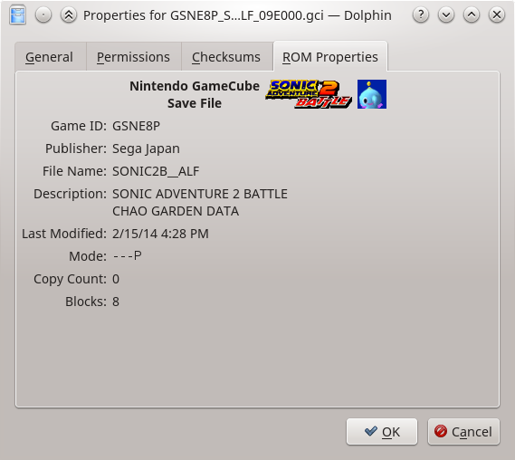

# ROM Properties Page shell extension

This shell extension adds a few nice features to file browsers for managing
video game ROM and disc images.

[](https://travis-ci.org/GerbilSoft/rom-properties)
[](https://ci.appveyor.com/project/GerbilSoft/rom-properties/branch/master)
[](https://scan.coverity.com/projects/10146)

## So what does it do?

Got a USB hard drive with Wii disc images for USB Loader GX or the Dolphin Emulator? Now you can actually see what those discs are:



Or maybe you're using Nintendont for GameCube:



How about some in-depth information on a GameCube save file? (The icon will be animated if your browser supports APNG.)



## Feedback

This is a work in progress; feedback is encouraged. To leave feedback, you
can file an issue on GitHub, or visit the Gens/GS IRC channel:
[irc://irc.badnik.zone/GensGS](irc://irc.badnik.zone/GensGS)

Or use the Mibbit Web IRC client: http://mibbit.com/?server=irc.badnik.zone&channel=#GensGS

## Installation

Currently, the ROM Properties Page shell extension is compatible with the
following platforms:
* KDE 4.x
* KDE Frameworks 5.x
* Windows XP (and later)

For instructions on compiling from source, see doc/COMPILING.md .

### Linux

Install the relevant .deb package, depending on what desktop environment you
are using and what your CPU is. Note that you may want to install the KDE4
package even if using KDE5, since many KDE programs still use the 4.x libraries.

After installing, the plugin needs to be enabled in the Dolphin file browser:
* Close all instances of Dolphin.
* Start Dolphin.
* Click Control, Configure Dolphin.
* Click the "General" section, then the "Preview" tab.
* Check the "ROM Properties Page" item, then click OK.
* Enable previews in a directory containing a supported file type.

If installed correctly, thumbnails should be generated for the supported
file type. You can also right-click a file, select Properties, then click
the "ROM Properties" tab to view more information about the ROM image.

### Windows

Extract the ZIP archive to a directory, then run the install.cmd file.
If using Windows Vista or later, install.cmd must be run as an administrator.
(Right-click the file, select "Run as administrator".)

Note that this will hard-code the location of the DLL files in the registry,
so you may want to place the DLLs in a common location.

To uninstall the plugin, run uninstall.cmd. This also requires administrator
access on Windows Vista and later.

## Current OS Feature Support Level

|     Platform     | Properties Tab | Thumbnails |
|------------------|:--------------:|:----------:|
| KDE 4.x          |       Yes      |     Yes    |
| KDE 5.x          |       Yes      |     Yes    |
| XFCE (Thunar)    |       Yes      |     No     |
| GNOME (Nautilus) |       No       |     No     |
| Windows          |       Yes      |     Yes    |

Notes:
* The KDE 4.x and 5.x plugins share most of the code. The only differences
  are in the plugin interface (due to automoc issues) and the .desktop file.
* The XFCE and GNOME file managers both use a similar interface for generating
  thumbnails, but with a different metadata file. Hence, once thumbnail support
  is implemented for one of them, it will also be implemented for the other.
* Windows supports separate icon and thumbnail handlers. Linux desktop
  environments generally use the file's MIME type to determine the icon, so
  custom icons are always implemented using the thumbnail interface.

## Current ROM Feature Support Level

|           System          | Properties Tab | Internal Images | External Scans |
|:-------------------------:|:--------------:|:---------------:|:--------------:|
| Sega Mega Drive           |       Yes      |       N/A       |       No       |
| Sega Dreamcast Saves      |       Yes      |   Icon, Banner  |       No       |
| Nintendo DS(i)            |       Yes      |       Icon      |       No       |
| Nintendo GameCube         |       Yes      |      Banner     |      Disc      |
| Nintendo GameCube Saves   |       Yes      |       Icon      |       N/A      |
| Nintendo Wii              |       Yes      |        No       |      Disc      |
| Nintendo Game Boy (Color) |       Yes      |       N/A       |       No       |
| Nintendo Game Boy Advance |       Yes      |       N/A       |       No       |
| Nintendo Virtual Boy      |       Yes      |       N/A       |       No       |
| Sony PlayStation Saves    |       Yes      |       Icon      |       N/A      |
| Nintendo amiibo           |       Yes      |        No       |      Media     |

Notes:
* Internal image refers to artwork contained within the ROM and/or disc image.
  These images are typically displayed on the system's main menu prior to
  starting the game.
  * "N/A" here means the ROM or disc image doesn't have this feature.
  * "No" indicates that the feature is present but not currently implemented.
* External scans refers to scans from an external database, such as GameTDB.com
  for GameCube and Wii.
  * "No" indicates no database is currently available for this system.
  * Anything else indicates what types of images are available.
  * For amiibo, "media" refers to the amiibo object, which may be a figurine,
    a card, or a plush.

There will eventually be a configuration window for setting which image
will be used for thumbnails (and icons on Windows).

## File Types Supported

* Sega Mega Drive: Plain binary (\*.gen, \*.bin), Super Magic Drive (\*.smd)
* Sega Dreamcast: Save files (\*.vmi, \*.vms, \*.dci)
* Nintendo DS(i): Decrypted (\*.nds)
* Nintendo GameCube: 1:1 disc image (\*.iso, \*.gcm) [including DiscEx-shrunken images],
  CISO disc image (\*.ciso), TGC embedded disc image (\*.tgc), save files (\*.gci, \*.gcs, \*.sav)
* Nintendo Wii: 1:1 disc image (\*.iso, \*.gcm), WBFS disc image (\*.wbfs),
  CISO disc image (\*.ciso)
* Nintendo Game Boy: Plain binary (\*.gb, \*.gbc, \*.sgb)
* Nintendo Game Boy Advance: Plain binary (\*.gba, \*.agb, \*.mb)
* Nintendo Virtual Boy: Plain binary (\*.vb)
* Sony PlayStation: Save files (\*.psv)
* Nintendo amiibo: Plain binary (\*.bin, \*.nfc, \*.nfp)

Some file types are not currently registered on Windows due to conflicts with
well-known file types, e.g. \*.bin, \*.iso, and \*.mb.

## External Media Downloads

Certain parsers support the use of external media scans through an online
database, e.g. GameTDB.com. The current release of the ROM Properties Page
shell extension will always attempt to download images from GameTDB.com if
thumbnail preview is enabled in the file browser and a supported file is
present in the current directory. An option to disable automatic downloads
will be added in a future version.

Downloaded images are cached to the following directory:
* Linux: `~/.cache/rom-properties/`
* Windows: `%LOCALAPPDATA%\rom-properties\cache`

The directory structure matches the source site, so e.g. a disc image of
Super Smash Bros. Brawl would be downloaded to
`~/.cache/rom-properties/wii/disc/US/RSBE01.png`. Note that if the download
fails for any reason, a 0-byte dummy file will be placed in the cache,
which tells the shell extension not to attempt to download the file again.
[FIXME: If the download fails due to no network connectivity, it shouldn't
do this.]

If you have an offline copy of the GameTDB image database, you can copy
it to the ROM Properties Page cache directory to allow the extension to
use the pre-downloaded version instead of downloading images as needed.

## Decryption Keys

Some newer formats, including Wii disc images, have encrypted sections. The
shell extension includes decryption code for handling these images, but the
keys are not included. To install the keys, create a text file called
`keys.conf` in the rom-properties configuration directory:

* Linux: `~/.config/rom-properties/keys.conf`
* Windows: `%APPDATA%\rom-properties\keys.conf`

The `keys.conf` file uses INI format. An example file, `keys.conf.example`,
is included with the shell extension. This file has a list of all supported
keys, with placeholders instead of the actual key data. For example, a
`keys.conf` file with the supported keys for Wii looks like this:

```
[Keys]
rvl-common=[Wii common key]
rvl-korean=[Wii Korean key]
```

Replace the key placeholders with hexadecimal strings representing the key.
In this example, both keys are AES-128, so the hexadecimal strings should be
32 characters long.

NOTE: If a key is incorrect, any properties dialog that uses the key to
decrypt data will show an error message instead of the data in question.

## Credits

### Developers

* @GerbilSoft: Main developer.
* @DankRank: Contributor, bug tester.
* @CheatFreak: Bug tester, amiibo support.

### Websites

* [GBATEK](http://problemkaputt.de/gbatek.htm): Game Boy Advance, Nintendo DS,
  and Nintendo DSi technical information. Used for ROM format information for
  those systems.
* [WiiBrew](http://wiibrew.org/wiki/Main_Page): Wii homebrew and reverse
  engineering. Used for Wii and GameCube disc format information.
* [GameTDB](http://www.gametdb.com/): Database of games for various game
  consoles. Used for automatic downloading of disc scans for Wii and GameCube.
* [Pan Docs](http://problemkaputt.de/pandocs.htm): Game Boy, Game Boy Color and
  Super Game Boy technical information. Used for ROM format information for
  those systems.
* [Virtual Boy Programmers Manual](http://www.goliathindustries.com/vb/download/vbprog.pdf):
  Virtual Boy technical information. Used for ROM format information for that
  system.
* [Sega Retro](http://www.segaretro.org/Main_Page): Sega Mega Drive technical
  information, plus information for other Sega systems that will be supported
  in a future release.
* [PS3 Developer wiki](http://www.psdevwiki.com/ps3/) for information on the
  "PS1 on PS3" save file format.
* [Nocash PSX Specification Reference](http://problemkaputt.de/psx-spx.htm)
  for more information on PS1 save files.
* [amiibo.life](http://amiibo.life): Database of Nintendo amiibo figurines,
  cards, and plushes. Used for automatic downloading of amiibo images.
